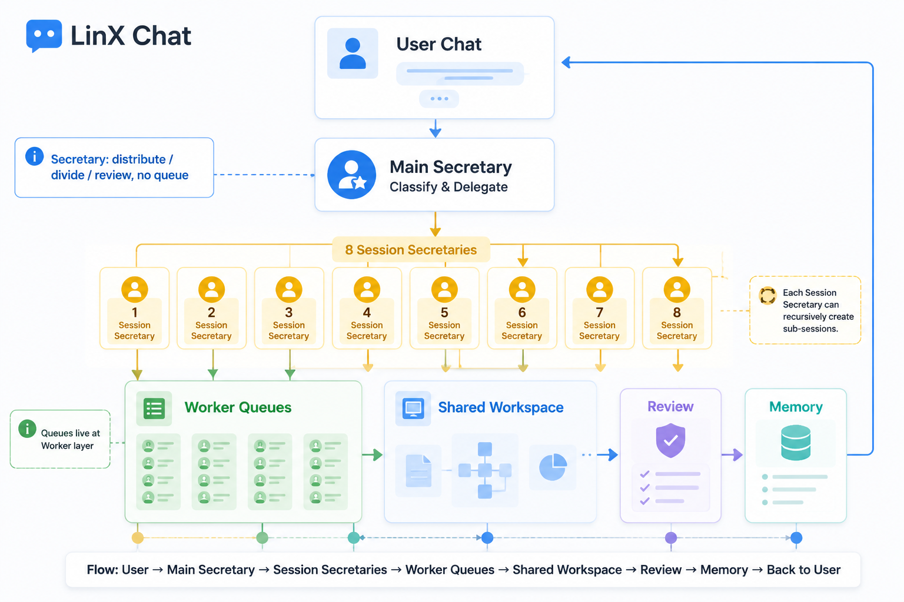

# LinX Chat 产品模型

> 产品讨论稿。本文先定义 LinX Chat 对用户意味着什么，不讨论 schema、Pod、RDF、API 或组件实现。

## 一句话定义

LinX Chat 不是一个普通聊天窗口，而是用户和 AI 秘书共同工作的主空间。

用户只需要和 Secretary 对话。无论背后有多少个干活的 AI、多少个并行会话、多少个仓库工作流，Secretary 都负责理解需求、拆分主题、派活、验收和回收结果。

用户不断和 Secretary 聊，Secretary 就不断把这条自然语言输入流归类、分发、投递到不同的 Worker 队列里。产品杠杆在这里：用户不是手动管理 1000 个 AI，而是通过一个 Secretary，驱动一个可以持续扩张的 AI 执行网络。

它把人与 AI、记忆、任务、文件和授权放在同一个连续对话里，让用户用自然语言推进事情，同时保留对数据和行动边界的控制。

## 产品目标

LinX Chat 要解决四个问题：

1. 用户不想在聊天、文件、任务、知识库、设置之间反复切换。
2. AI 需要长期上下文，才能从“问答工具”变成“秘书”。
3. 用户需要看得见、能干预、可追溯的 AI 行动过程。
4. 用户需要把 AI 工作并行化，但不想亲自管理多个 AI 的上下文和队列。

## 核心体验

### 1. Chat 是主入口

用户进入 LinX 后，第一眼看到的不是文件夹、表格或工作台，而是一个可以继续上次工作的聊天空间。

Chat 承载：

- 与 AI 秘书的日常对话
- Secretary 代表用户调度多个 AI 的工作过程
- 与联系人或群组的沟通
- 围绕文件、记忆、任务的上下文
- AI 的建议、计划、执行、确认和结果回收

### 2. 对话是工作流，不只是消息

一段 Chat 可以包含多种内容：

- 用户表达意图
- AI 提问澄清
- AI 生成计划
- AI 调用工具或运行任务
- 用户确认、拒绝或修改
- 结果沉淀为记忆、文件、任务或审计记录

所以 LinX Chat 的基本单位不是“消息列表”，而是“协作过程”。

### 3. Thread 是一次具体工作的上下文

Chat 可以是一个长期关系或空间，Thread 是其中一次具体讨论或任务。

例如：

- Chat：我的 AI 秘书
- Thread：整理本周会议记录
- Thread：规划东京行程
- Thread：复盘一个代码问题

Thread 的价值是让用户保留长期关系，同时把具体事项分开。

### 4. Message 是协作过程的片段

Message 不只代表一句话，也可能代表一个可交互片段：

- 普通文本
- AI 思考摘要
- 工具调用状态
- 用户确认卡片
- 文件引用
- 任务结果
- 后续行动建议

产品上，Message 应该让用户快速理解“现在发生了什么、为什么发生、我能做什么”。

### 5. Secretary 是唯一用户接口

LinX 不把多个 AI 直接暴露给用户。用户不需要判断该找哪个模型、哪个 agent、哪个线程，也不需要手动维护一堆工作队列。

Secretary 负责：

- 理解用户的新需求
- 判断需求属于已有主题，还是应该新建会话
- 给合适的干活 AI 派任务
- 让干活 AI 在对应 workspace 里协作
- 验收结果并决定是否继续追问、返工或交付
- 把最终结果用用户能理解的方式汇报回来

### 6. 多 AI 是后台执行结构

用户看到的是一个 Secretary，对后台来说可能同时存在多个会话。

每个会话围绕一个主题展开，例如：

- 修复 drizzle-solid 的 id 语义
- 整理 xpod 文档
- 设计 LinX Chat 产品模型
- 处理某个仓库的测试失败

会话下面可以有多个干活 AI。它们共享同一个 workspace，围绕同一个主题协作，但各自有独立的执行队列。

### 7. 并发度是用户可调的吞吐能力

同一个 AI 或同一个仓库可以有多个 thread + worktree。产品上，这代表这个仓库或这个主题允许多少条任务线并行推进。

用户不需要理解所有底层细节，但应该能控制：

- 某个仓库最多同时跑几条任务
- 某个主题是否允许并发
- 某个任务是否必须串行等待验收
- 当前并发是否太高，需要暂停或收缩

并发度越高，吞吐越高，但上下文冲突、验收压力和资源消耗也更高。

### 8. 一个人驱动大量 AI

LinX Chat 的关键不是“给用户更多 AI”，而是让用户不需要管理这些 AI。

用户只持续表达意图，Secretary 把意图转成后台工作：

- 识别主题
- 复用或创建 Session
- 把任务投递到对应 Worker 队列
- 观察 Worker 队列的执行状态
- 验收结果
- 把可交付内容带回用户主对话

因此，一个人可以通过一个 Secretary 同时驱动大量 AI。AI 数量越多，用户界面不应该越复杂；复杂度应该被 Secretary 和它的分身吸收。

### 9. 每层默认 8 路分治

为了让调度保持可理解、可验收、可恢复，每个 Secretary 或 Secretary 分身默认只直接管理 8 个活跃子会话或分治分支。

“一层 8 个”不是技术硬限制，而是产品默认心智：

- 少于 8 个：直接作为当前 Secretary 的子会话或分治分支。
- 超过 8 个：合并相近主题，或创建下一层 Secretary 分身继续分治。
- 高风险任务：即使没到 8 个，也可以主动降低并发。
- 高吞吐任务：可以通过更多层级扩展，而不是让同一层变得拥挤。

这样用户侧始终保持一个入口，每一层也保持有限管理宽度；规模来自层级、分治和 Worker 队列，而不是把 1000 个 AI 平铺给人看。

## 产品对象

### Secretary

Secretary 是用户唯一直接对话的 AI。

它不是一个普通 assistant，而是用户侧第一层 AI 工作调度者：

- 接收用户需求
- 拆分主题和任务
- 选择或创建会话
- 向对应 Session 的 Secretary 分身派活
- 追踪第一层进度
- 验收最终成果
- 汇总给用户

用户侧 Secretary 不需要亲自管理每个 Worker AI 的细节。它只负责第一层分类、分发和最终体验一致性。

讨论问题：

- Secretary 应该多主动？
- Secretary 是否应该默认隐藏后台 AI 的详细过程？
- 用户什么时候需要看到“是谁在干活”？

### Secretary 分身

Secretary 分身是某个 Session 内的局部调度者。

当用户侧 Secretary 创建或复用一个 Session 后，这个 Session 里会有一个对应的 Secretary 分身。它继承主 Secretary 给出的目标、约束和上下文，然后在局部范围内继续拆解工作。

Secretary 分身负责：

- 理解当前 Session 的目标
- 把局部任务拆给 Worker AI
- 把任务投递到这个 Session 里的 Worker 队列
- 必要时创建更细的子 Session
- 验收局部成果
- 向上层 Secretary 汇报摘要、风险和交付物

这形成一个分治结构：用户侧 Secretary 管第一层，每个 Session 的 Secretary 分身管自己的局部工作；如果局部工作继续变复杂，分身也可以创建新的会话和新的分身。

讨论问题：

- Secretary 分身是否需要被用户看见？
- 分身的决策失败时，由主 Secretary 兜底，还是暴露给用户确认？
- 分身之间如何共享记忆、边界和已完成事实？

### Session

Session 是 Secretary 为一个主题创建的工作会话。

它不是用户聊天窗口里的普通 Thread，而是后台工作组织单元。一个 Session 通常对应：

- 一个明确主题
- 一个 Secretary 分身
- 一组干活 AI
- 一个共享 workspace
- 一组可并行推进的 thread + worktree
- 一个验收标准

Session 的创建规则：

- 新任务如果和活跃主题相关，就插入对应 Session。
- 新任务如果没有明显相关主题，就创建新的 Session。
- 如果任务属于群组语境，则进入群组 Session，并由中控模型判断谁应该回答。

讨论问题：

- Session 是否需要在 UI 上显式展示？
- 用户是否可以手动合并或拆分 Session？
- Session 结束后应该变成历史、摘要，还是记忆？

### Worker AI

Worker AI 是干活的 AI。

它们不直接面向用户，而是接收 Secretary 分身或中控模型派发的任务。Worker AI 负责在自己的 thread + worktree 上完成具体工作。

Worker AI 拿到新任务时，需要先判断：

- 这个任务是否和某个活跃 Session 高度相关
- 如果相关，是否应该通过自己的分身进入那个 Session，并投递到对应 Worker 队列
- 如果不相关，是否需要请求 Secretary 创建新 Session

讨论问题：

- Worker AI 的“分身”在产品上是否需要命名？
- Worker AI 的工作过程应该透明到什么程度？
- Worker AI 失败时，是直接让用户看到，还是只由 Secretary 汇报？

### Coordinator

Coordinator 是群组会话里的中控模型。

当一个 Session 里存在多个可能回答者时，Coordinator 判断当前上下文应该由谁响应、谁补充、谁等待。

它负责：

- 判断当前轮次需要谁回答
- 避免多个 AI 同时抢答
- 把任务路由给最合适的 Worker AI
- 维持群组会话的节奏

讨论问题：

- Coordinator 是否只存在于群组模式？
- Secretary 和 Coordinator 是同一个模型的两个角色，还是两个独立角色？
- 用户是否需要看到 Coordinator 的判断？

### Chat

Chat 是用户看到的一级入口。它代表一个长期对话空间。

可能的 Chat 类型：

- AI 秘书
- 单个联系人
- 多人或多代理群组
- 围绕一个项目、文件夹或主题的工作空间

讨论问题：

- LinX v1 是否只保留 Secretary Chat？
- 自然人聊天和 AI 聊天是否应该在同一个列表里？
- 项目型 Chat 和联系人型 Chat 是否需要视觉区分？

### Thread

Thread 是 Chat 内的一次具体事项。

它帮助用户：

- 把长期对话拆成可回溯的事项
- 避免一个 Chat 里混入太多主题
- 让 AI 更容易恢复上下文

讨论问题：

- Thread 是否默认自动创建？
- 用户是否需要显式看到 Thread 列表？
- Thread 更像“话题”、"任务"，还是“会话分支”？

### Message

Message 是时间线中的最小展示单元。

Message 应该支持普通阅读，也应该支持行动：

- 复制
- 收藏
- 引用回复
- 转为任务
- 保存为记忆
- 对 AI 行动进行确认或撤销

讨论问题：

- v1 是否只支持文本消息？
- AI 工具调用是否作为 Message 展示，还是折叠到 AI 回复里？
- 用户确认卡片是否算 Message？

### Memory

Memory 是从 Chat 中沉淀出来的长期上下文。

它不是用户手动维护的知识库，而是 AI 秘书在用户授权下帮助整理出的可复用记忆。

讨论问题：

- 什么内容应该自动沉淀为记忆？
- 用户是否需要每次确认？
- 记忆应该像“笔记”展示，还是藏在 AI 上下文里？

### Action

Action 是 AI 代表用户做事的过程。

典型 Action：

- 查找资料
- 整理文件
- 总结对话
- 创建任务
- 发送消息
- 修改某个用户数据

讨论问题：

- 哪些 Action 可以自动执行？
- 哪些 Action 必须用户确认？
- 用户如何查看和撤销 Action？

### Workspace

Workspace 是一个 Session 里所有 Worker AI 共同工作的空间。

产品上，Workspace 表示“这批 AI 正在同一件事上协作”。在开发类任务里，它可能对应同一个仓库；在非开发类任务里，它可能对应同一组文件、素材、资料或上下文。

讨论问题：

- 用户是否需要看到 Workspace 的状态？
- Workspace 是按项目创建，还是按 Session 创建？
- Workspace 冲突时，Secretary 如何向用户解释？

### Execution Lane

Execution Lane 是一个可并行推进的执行槽。

在开发场景里，一个 Execution Lane 可以对应一个 thread + worktree。用户看到的不是底层结构，而是某个仓库或主题的并发能力。

讨论问题：

- 并发度应该默认自动管理，还是用户可调？
- 并发度设置应该按仓库、按项目，还是按用户全局？
- 什么时候 Secretary 应该提醒用户降低并发？

## Secretary 驱动的协作规则

### 用户只和 Secretary 聊

不管后台有多少 Worker AI，用户都只向 Secretary 表达需求。

Secretary 可以把后台工作过程摘要给用户，但不要求用户直接进入每个 Worker AI 的上下文。

### 用户侧 Secretary 只管第一层

用户侧 Secretary 的核心职责不是扁平地调度所有 Worker AI，而是把用户连续输入的自然语言流分成第一层主题和会话。

每个第一层 Session 都有一个 Secretary 分身继续接管局部工作。这样后台规模可以扩张，但用户仍然只面对一个入口。

### 分身继续分治创建会话

当某个 Session 内部变复杂时，Secretary 分身可以继续创建子 Session。

例如：

1. 用户说：“把 LinX Chat 的产品模型整理成文档，再顺便准备一版演示图。”
2. 用户侧 Secretary 创建“LinX Chat 产品文档”Session。
3. 该 Session 的 Secretary 分身发现里面有“产品叙事”“视觉表达”“待讨论问题”三个子主题。
4. 分身创建或复用子 Session，并把任务投递给对应 Worker 队列。
5. 子 Session 的结果先回到分身验收，再回到用户侧 Secretary 统一交付。

这让 LinX Chat 可以从一个入口自然扩展成多层 AI 协作树，但用户不需要理解这棵树。

### 每层最多直接管理 8 个分治分支

每个 Secretary 或 Secretary 分身默认维护最多 8 个直接活跃子会话或分治分支。

Secretary 层没有“排队”语义。Secretary 和分身只负责分发、分治、验收；真正等待执行的是 Worker 侧队列。

当第 9 个任务进入时，系统先判断：

1. 是否能归入已有 8 个分治分支之一。
2. 是否应该合并相近主题，避免无意义扩张。
3. 是否应该创建下一层 Secretary 分身继续分治。
4. 是否应该投递到某个 Worker 队列等待执行。
5. 是否需要向上层 Secretary 请求用户确认，提升或降低并发。

这个限制让并发可控，也让验收压力不会在单层爆炸。

### Secretary 决定新任务归属

用户提出新任务后，Secretary 先判断它属于哪种情况：

1. 与某个活跃 Session 强相关：插入该 Session。
2. 与多个 Session 相关：询问用户，或选择主 Session 并引用其他 Session。
3. 没有明显相关主题：创建新 Session。
4. 属于群组对话：交给 Coordinator 判断当前应由谁响应。

### Worker AI 可以分身进入相关 Session

当某个 Worker AI 接到任务时，它也要判断任务是否属于已有主题。

如果相关，它可以通过自己的分身进入对应 Session，并把执行工作放到对应 Worker 队列；如果不相关，它向 Secretary 请求新建 Session。

这让同一个 AI 能在多个主题中并行工作，但仍由 Secretary 保持总控。

### Secretary 验收再交付

Worker AI 完成后，不直接把结果丢给用户。

Secretary 需要先验收：

- 是否完成用户目标
- 是否和当前主题一致
- 是否有冲突或遗漏
- 是否需要继续派活
- 是否应该保存为记忆、文档、任务或审计记录

验收通过后，Secretary 再向用户汇报。

### 并发度影响吞吐

同一个仓库或同一个 AI 的 thread 越多，代表并发度越高。

产品上可以把它理解为“这个工作空间一次能同时处理多少条任务线”。用户可以根据需求吞吐调整并发：

- 低并发：更稳，适合高风险任务
- 中并发：默认模式，适合日常工作
- 高并发：更快，适合大量独立任务，但需要更强验收

当会话层级变深时，并发度由两部分构成：Secretary 分身负责分治宽度，Worker 负责执行队列。用户调的不是“开多少机器人”，而是这个工作空间允许多大的吞吐。

## 用户旅程草稿

### 场景 A：用户让 AI 整理资料

1. 用户说：“帮我整理一下上周关于 xpod 的讨论。”
2. AI 先说明会查找哪些范围。
3. 用户确认或修改范围。
4. AI 检索、总结、列出不确定点。
5. 用户选择保存为记忆、导出文档或继续追问。

### 场景 B：用户继续一个未完成事项

1. 用户打开 LinX。
2. Chat 列表显示“继续整理 xpod 文档”。
3. 用户进入后看到上次 Thread 的摘要。
4. AI 给出下一步建议。
5. 用户一句话继续推进。

### 场景 C：AI 需要用户授权

1. AI 准备执行一个会修改数据的动作。
2. Chat 中出现确认卡片。
3. 卡片说明动作、影响范围、可选项和超时行为。
4. 用户允许、拒绝或调整条件。
5. 执行结果回到同一条时间线里。

### 场景 D：用户提出一个复杂开发需求

1. 用户只对 Secretary 说：“把 chat 模型和 xpod 页都整理一下。”
2. Secretary 判断这是多个主题，创建或复用相关 Session。
3. Secretary 把模型设计、文档整理、页面调整派给不同 Worker AI。
4. Worker AI 在同一 workspace 下各自进入 thread + worktree。
5. Secretary 跟踪进度，发现冲突时调整分发策略。
6. Worker AI 完成后，Secretary 验收结果。
7. Secretary 向用户汇报完成内容、风险和下一步。

### 场景 E：新任务插入已有主题

1. 用户说：“顺便看一下刚才那个 byId 命名。”
2. Secretary 识别它属于正在活跃的 drizzle-solid Session。
3. 相关 Worker AI 的分身进入该 Session，并把执行工作放到对应 Worker 队列。
4. 结果回到原 Session 的上下文，不新开无关对话。

### 场景 F：群组会话由中控路由

1. 群组 Session 中有多个 AI 角色。
2. 用户或某个 AI 发出新消息。
3. Coordinator 判断当前应该谁回答、谁补充、谁等待。
4. 对应 Worker AI 响应。
5. Secretary 维持用户侧总结和验收。

## 产品功能示意图

这张图表达的是功能和流程，不是氛围概念：

- 用户只进入 User Chat，不直接面对多个 AI。
- Main Secretary 做分类和分发，负责第一层调度。
- 第一层最多 8 个 Session Secretaries，每个分身负责一个局部主题。
- Session Secretary 可以继续创建子会话，但不会在 Secretary 层排队。
- Worker Queues 是真正等待执行的地方。
- Shared Workspace 是 Worker 实际协作和产出的位置。
- Review 是 Secretary 回收和验收结果的关口。
- Memory 保存验收后的稳定事实，并回到用户侧体验。

视觉验收：

- 通过：图是产品功能示意图，不是氛围插画。
- 通过：包含 User Chat、Main Secretary、8 Session Secretaries、Worker Queues、Shared Workspace、Review、Memory。
- 通过：明确表达 Secretary 只做 distribute / divide / review，不做 queue。
- 通过：明确表达 Queues live at Worker layer。
- 通过：底部流程串起 User -> Secretary -> Session Secretaries -> Worker Queues -> Workspace -> Review -> Memory -> User。

## 视觉文档待补

后续定稿时需要补三类图：

- 概念图：Chat、Thread、Message、Memory、Action 的关系
- 分层图：主 Secretary、Session Secretary 分身、Worker AI、Workspace 的关系
- 旅程图：用户从提出意图到结果沉淀的过程
- 界面图：Chat 列表、Thread 列表、协作时间线、确认卡片的产品布局

## 遗留问题：Secretary 与分身如何共享记忆

分层 Secretary 模型成立后，最大的产品问题是记忆共享。

如果每个 Secretary 分身都独立记忆，系统会变成很多局部 AI，各自知道一部分事实，最终出现上下文割裂。如果所有分身都共享完整记忆，又会带来噪音、权限、隐私和判断负担。

需要讨论的方向：

- 主记忆：用户侧 Secretary 持有用户偏好、长期事实、全局边界和最终决策。
- 会话记忆：每个 Session 分身持有当前主题的目标、上下文、约束、分治状态和局部结论。
- 上行摘要：分身不把所有细节同步给主 Secretary，而是同步可交付成果、风险、阻塞、决策点和稳定事实。
- 下行约束：主 Secretary 给分身下发用户偏好、权限边界、当前目标和验收标准。
- 横向引用：两个分身如果主题相关，应通过主 Secretary 或共享索引引用彼此结论，而不是随意互相污染上下文。
- 记忆晋升：局部事实只有在被验收后，才从会话记忆晋升为主记忆。

产品上，用户需要感受到“Secretary 一直记得我”，但不应该被迫理解每个分身的内部记忆同步。

## 当前待讨论

1. LinX Chat 的第一性定位：聊天工具、AI 秘书工作台，还是个人操作系统入口？
2. Chat 和 Thread 的边界如何给普通用户讲清楚？
3. AI 行动和普通消息是否应该在同一条时间线里展示？
4. 记忆沉淀是自动、半自动，还是完全手动？
5. v1 最小闭环应该保留哪些对象，砍掉哪些对象？
6. Session 是否应该作为用户可见对象，还是只由 Secretary 在后台管理？
7. 并发度控制应该暴露成“快/稳/高吞吐”模式，还是直接暴露 thread/worktree 数量？
8. Coordinator 的判断过程是否需要被用户看见？
9. Secretary 分身是否是产品可见对象，还是完全作为后台调度能力？
10. 主 Secretary 和分身之间的记忆共享，应该是全量共享、摘要同步，还是验收后晋升？
11. “一层 8 个”是否作为默认产品规则进入 v1，还是只作为高级吞吐模式的解释模型？
